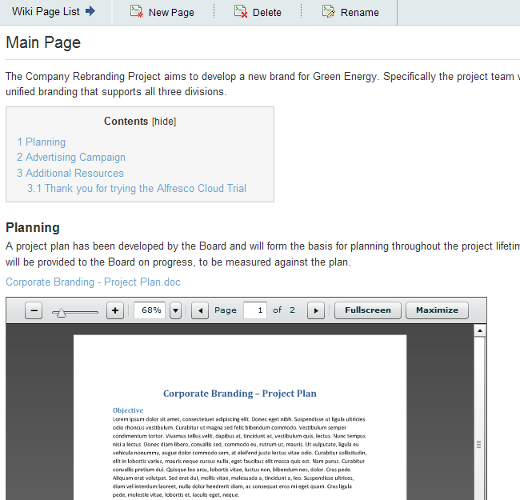
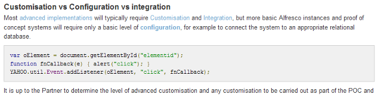

Wiki Rich Content improvements for Alfresco Share
=================================================

Author: Will Abson

This project implements a number of customisations to the Alfresco Share wiki component to improve its visual appearance, and add support for dynamic tables of contents, embedded document previews, in-line data lists/tables and syntax-highlighted code using [Google Code Prettify](http://code.google.com/p/google-code-prettify).

The add-on has been tested against Alfresco version 3.3/3.4 and version 4.x.

Installation
------------

The customisations are packaged as a single JAR file for easy installation into Alfresco Share.

To install the customisations, simply drop the `wiki-rich-content-<version>.jar` file into the `tomcat/shared/lib` folder within your Alfresco installation, and restart the application server. You might need to create this folder if it does not already exist.

In *Alfresco 4.x*, you need to enable the module named _Wiki Rich Content_ module within the module deployment console, once you have started Alfresco. You can access the console by visiting the following URL.

`http://servername:port/share/page/modules/deploy`

Once you have added the module to the Deployed list, you must then click *Apply Changes* to make the changes take effect.

Separate modules are provided for adding ToCs, in-line data lists/tables and syntax-highlighted code and  YouTube/Vimeo videos, so you can choose the enhancements you need.

Building from Source
--------------------

An Ant build script is provided to build a JAR file containing the custom files, which can then be installed into the `tomcat/shared/lib` folder of your Alfresco installation.

To build the JAR file, run Ant from the base project directory.

    ant dist-jar

The command should build a JAR file named `wiki-rich-content-<version>.jar` in the `build/dist` directory within your project, which you can then copy into the `tomcat/shared/lib` folder of your Alfresco installation.

Alternatively, you can use the build script to _hot deploy_ the JAR file directly into a local Tomcat instance for testing. You will need to use the `hotcopy-tomcat-jar task` and set the `tomcat.home`
property in Ant.

    ant -Dtomcat.home=C:/Alfresco/tomcat hotcopy-tomcat-jar
    
After you have deployed the JAR file you will need to restart Tomcat to ensure it picks up the changes.

Usage
-----

  1. Log in to Alfresco Share and navigate to a site with some wiki content
  2. Locate a wiki page and click the *Edit Page* link at the top of the page, _or_ create a new page by hitting the *New Page* button. You can now edit the contents of the page in the inline editor.
    * To have the *table of contents* be shown, add some headings (at least 2) to the page
    * To show the *code highlighting*, add some preformatted text to the page
    * To show a *document preview* or a YouTube or Vimeo *video*, use the *Insert/edit Link* button to add a link to the item and specify the target _Embed preview with link_ or _Embed preview with no link_ from the *Target* drop-down list
    * To turn an existing table into a [YUI DataTable](http://developer.yahoo.com/yui/datatable/), add the class `datatable` to the table from the _Insert/edit new table_ dialogue.
    * To embed a Data List, create a new empty table, specifying the class `datatable:aaaa-bbbb-cccc-dddd`, where the last part is the name of a Data List in the site (which you can find on the end of the List URL in your browser)
    * If you want to show only specific columns from the Data List then add some column headings to the table, ensuring that these match the names of the properties in the Data List, e.g. `Name` or `cm_name`.